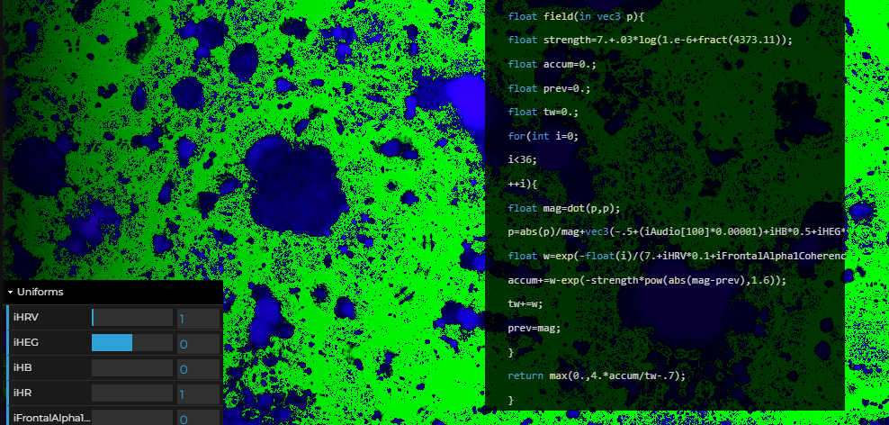

## THREEShaderHelper

`npm i threeshaderhelper`

This is a fairly straightforward utility for ThreeJS to create shader materials and apply any shaders from text with the ability to push uniform updates. It replicates a lot of functionality from ShaderToy, but we extended it to let us use arbitrary uniforms which can be generated from the shader text itself. We use it for biofeedback. It also includes its own audio decoder to get audio FFT data into the shader.

## Example

To run the example, 

`cd example`

`npm i -g tinybuild` if not installed

then

`npm start` or `tinybuild` to run

```js

// Import necessary dependencies
import * as THREE from 'three'
import { THREEShaderHelper, Sounds } from 'threeshaderhelper/THREEShaderHelper'; // Assuming this is the file where your shader helper class is defined
import { Sounds } from 'threeshaderhelper/sound'; // Assuming this is where your Sounds class is defined

// Function to run the default shader and play a sound
export function main() {
    // Create a canvas element and append it to the body
    // Create a button to play the sound
    const button = document.createElement('button');
    button.innerText = 'Play Sound';
    document.body.appendChild(button);
    
    const canvas = document.createElement('canvas');
    canvas.style.width = '512px';
    canvas.style.height = '512px';
    document.body.appendChild(canvas);

    const sounds = new Sounds();

    //setTimeout(()=>{
    canvas.width = canvas.clientWidth;
    canvas.height = canvas.clientHeight;

    // Instantiate the THREEShaderHelper with the canvas
    const shaderHelper = new THREEShaderHelper(
        canvas, 
        sounds,
        THREEShaderHelper.defaultFragment, //replace with shader text
        undefined //can use the default vertex shader by leaving undefined
    );
    
    // Set up the default renderer and start the animation loop
    shaderHelper.createRenderer();

    // Optional: Set a background color for the renderer to see if it updates
    shaderHelper.three.renderer.setClearColor(0x000000, 1);
    //}, 300);


    // Instantiate the Sounds class when the button is clicked and play a default sound
    button.addEventListener('click', () => {
        const soundURL = './sample.mp3'; // Default sound URL
        sounds.addSounds([soundURL], (sourceListIdx) => {
            sounds.playSound(sourceListIdx);
        });
    });
}

main();

```

Originally made for [Sensorium](https://app.brainsatplay.com#Sensorium) biofeedback demo with live editor. Select Audio FFT in the effects and load your mic or a random sound for the magic.


### Class methods

####  Static Methods
`THREEShaderHelper.generateShaderGeometry(type, width, height, fragment, vertex)`
Generates a shader mesh with the specified geometry type, dimensions, and shaders. Returns a THREE.Mesh object with a ShaderMaterial applied.

`THREEShaderHelper.generateShaderMaterial(fragment, vertex)`
Creates a ShaderMaterial using the provided fragment and vertex shaders. Returns a THREE.ShaderMaterial.

`THREEShaderHelper.createMeshGeometry(type, width, height)`
Generates geometry based on the specified type ('plane', 'sphere', 'circle', 'halfsphere', 'vrscreen'). Returns the corresponding THREE.Geometry.

`THREEShaderHelper.downsample(array, fitCount, scalar)`
Downsamples the provided array to the specified size, averaging values if necessary. Useful for reducing data size.

`THREEShaderHelper.upsample(data, fitCount, scalar)`
Upsamples the provided data array to the specified size using linear interpolation. Useful for increasing data resolution.

#### Frontend Methods
`this.createRenderer(canvas)`
Initializes the Three.js renderer, scene, and camera, setting up the environment for rendering the shader.

`this.destroyRenderer()`
Cleans up and disposes of all renderer resources, including geometry and materials, to free up memory.

`this.generateGUI(uniformNames, material)`
Creates a GUI interface for interacting with the shader's uniforms, allowing for real-time adjustments.

`this.clearGUI()`
Remove the GUI items you created, if it exists. Auto clears if calling generateGUI multiple times.

#### More Instance Methods for Frontend Use
`this.addUniformSetting(name, defaultValue, type, callback, min, max, step)`
Adds a new uniform setting to the shader, allowing for customization and interaction through GUI controls.

`this.addNewShaderMesh(fragment, vertex, type, width, height, name, author)`
Creates and adds a new shader mesh to the scene with the specified fragment and vertex shaders, geometry type, and dimensions.

`this.setUniforms(uniforms)`
Updates the values of the specified uniforms, allowing for dynamic interaction with the shader's parameters.

`this.setMeshGeometry(matidx, type)`
Sets the geometry of the specified mesh to a new type, such as 'plane' or 'sphere', and updates its rotation.

`this.setMeshRotation(matidx, anglex, angley, anglez)`
Adjusts the rotation of the specified mesh to the provided angles.

`this.resetMaterialUniforms(material, uniformNames)`
Resets the material's uniforms to their default values based on the current uniform settings.

`this.updateMaterialUniforms(material, uniformNames, meshType)`
Dynamically updates the material's uniforms based on the current time, mouse input, and other parameters.

`this.updateAllMaterialUniforms()`
Updates all the uniforms for all materials in the scene simultaneously, ensuring consistency across multiple shaders.

`this.setShaderFromText(matidx, fragmentShaderText, vertexShaderText, name, author)`
Sets a shader from provided text for both fragment and vertex shaders, and applies it to the specified material index.

`this.swapShader(matidx, onchange)`
Swaps the shader for the specified material index and applies any additional changes using the provided callback.

`this.setShader(matidx, name, vertexShader, fragmentShader, uniformNames, author)`
Configures a shader for the specified material index, using the provided shader text, name, and author.

`this.setChannelTexture(channelNum, imageOrVideo, material)`
Sets a texture or video as the input for a specific channel in the shader, updating the corresponding uniform values.

#### Default Shaders
`THREEShaderHelper.defaultVertex`
A basic vertex shader used as a default when no custom vertex shader is provided.

`THREEShaderHelper.defaultFragment`
A comprehensive fragment shader with multiple uniform inputs, including time, resolution, and audio data.

`THREEShaderHelper.defaultFragmentSimple`
A simple shader with audio and other input


# Default Uniforms in `THREEShaderHelper`

The `THREEShaderHelper` class provides a set of default uniforms that can be used in your shaders. Below is a list of these uniforms, along with the corresponding GLSL code that needs to be added to your shader. It vaguely mimics shadertoy, the channel/image texture stuff is untested right now fyi

## 1. `iResolution`
- **Type**: `vec2`
- **Description**: Represents the display resolution of the shader.
- **GLSL Code**: 
    ```glsl
    uniform vec2 iResolution;
    ```

## 2. `iTime`
- **Type**: `float`
- **Description**: The elapsed time in seconds since the start of the shader.
- **GLSL Code**: 
    ```glsl
    uniform float iTime;
    ```

## 3. `iTimeDelta`
- **Type**: `float`
- **Description**: The time difference between the current frame and the last frame.
- **GLSL Code**: 
    ```glsl
    uniform float iTimeDelta;
    ```

## 4. `iFrame`
- **Type**: `int`
- **Description**: The current frame number.
- **GLSL Code**: 
    ```glsl
    uniform int iFrame;
    ```

## 5. `iFrameRate`
- **Type**: `float`
- **Description**: The current frame rate in frames per second.
- **GLSL Code**: 
    ```glsl
    uniform float iFrameRate;
    ```

## 6. `iChannelTime`
- **Type**: `float[4]`
- **Description**: Time for each input channel (i.e., texture or video).
- **GLSL Code**: 
    ```glsl
    uniform float iChannelTime[4];
    ```

## 7. `iChannelResolution`
- **Type**: `vec3[4]`
- **Description**: Resolution for each input channel.
- **GLSL Code**: 
    ```glsl
    uniform vec3 iChannelResolution[4];
    ```

## 8. `iChannel0`, `iChannel1`, `iChannel2`, `iChannel3`
- **Type**: `sampler2D`
- **Description**: Sampler for each input texture or video channel.
- **GLSL Code**: 
    ```glsl
    uniform sampler2D iChannel0;
    uniform sampler2D iChannel1;
    uniform sampler2D iChannel2;
    uniform sampler2D iChannel3;
    ```

## 9. `iSampleRate`
- **Type**: `float`
- **Description**: The audio sample rate in Hz.
- **GLSL Code**: 
    ```glsl
    uniform float iSampleRate;
    ```

## 10. `iDate`
- **Type**: `vec4`
- **Description**: The current date (year, month, day, time).
- **GLSL Code**: 
    ```glsl
    uniform vec4 iDate;
    ```

## 11. `iMouse`
- **Type**: `vec4`
- **Description**: Mouse coordinates in the window (x, y, click position).
- **GLSL Code**: 
    ```glsl
    uniform vec4 iMouse;
    ```

## 12. `iMouseInput`
- **Type**: `bool`
- **Description**: Indicates whether the mouse is clicked.
- **GLSL Code**: 
    ```glsl
    uniform bool iMouseInput;
    ```

## 14. `iAudio`
- **Type**: `float[256]`
- **Description**: The audio FFT data sampled from the sound object provided
- **GLSL Code**: 
    ```glsl
    uniform float iAudio[256];
    ```


## 13. `iImage`
- **Type**: `sampler2D`
- **Description**: The main texture (usually the canvas) to be used in the shader.
- **GLSL Code**: 
    ```glsl
    uniform sampler2D iImage;
    ```
